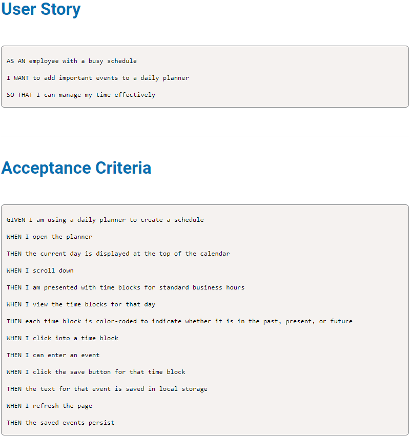

# Work Day Scheduler

## Description
This project helps us with our organization during our busy schedule. Page displays our working hours, and each hour has a block on its own where you can input your to do task.
if you click on save button for each task data will save to your local storage and you will be able to access it even if the page is refreshed.

---
## Installation 
* Clone the repository  
```
git clone git@github.com:Jelenarog/Work-Day-Scheduler.git
```
---
## Usage


---
## Links
[Github Repository Link](https://github.com/Jelenarog/Work-Day-Scheduler)<br/>
 [Deployed website](https://jelenarog.github.io/Work-Day-Scheduler/)<br/>
 [HTML code](.//Assets/Images/HTML%20code.png)<br/>
 [JavaScript](.//Assets/Images/Java.sc.png)

---

## Credits
 [Starter code](https://github.com/coding-boot-camp/crispy-octo-meme)<br/>

---

 ---

## License 

Please refer to the LICENSE in the repo.

---